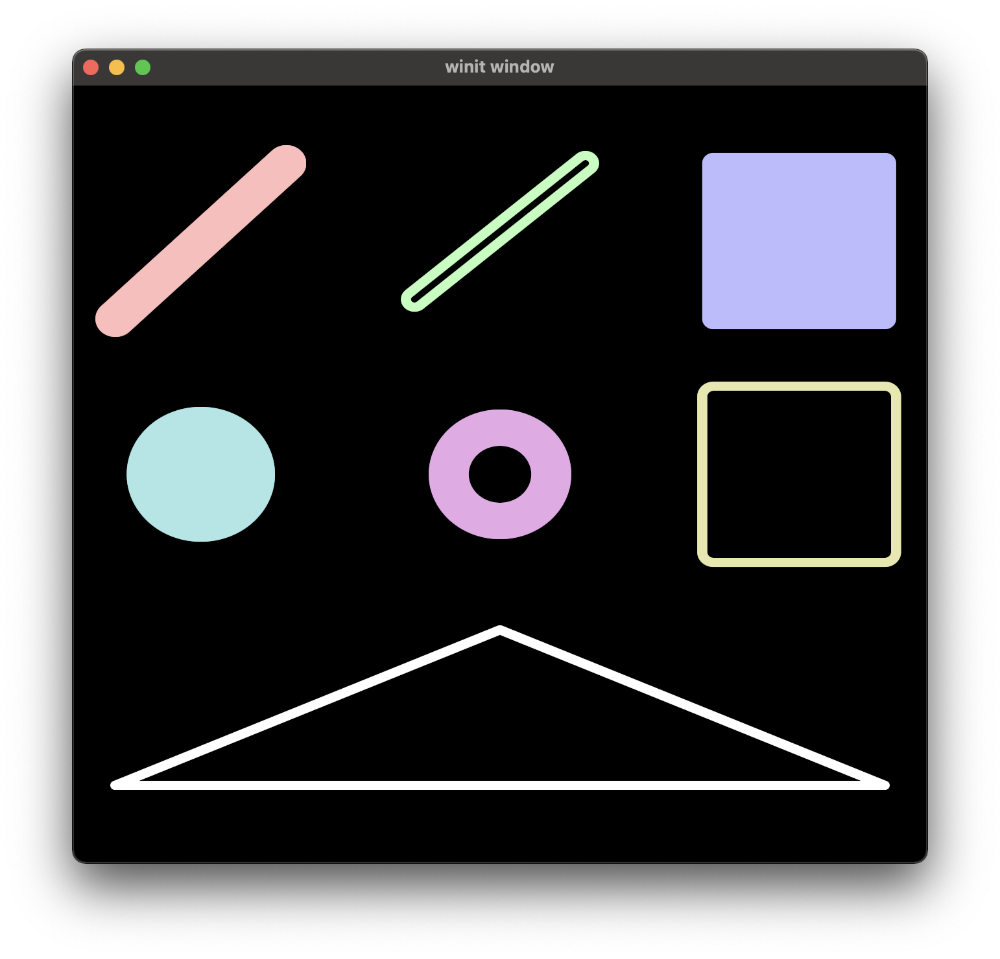

# vg-2d

vg-2d is a simple vector drawing library for wgpu. It is currently in WIP stage,
with many features and optimizations lacking. See the examples for how to use it.

**Despite the name, vg-2d is not tied to the VG library and can be used on its own**

## Preview

